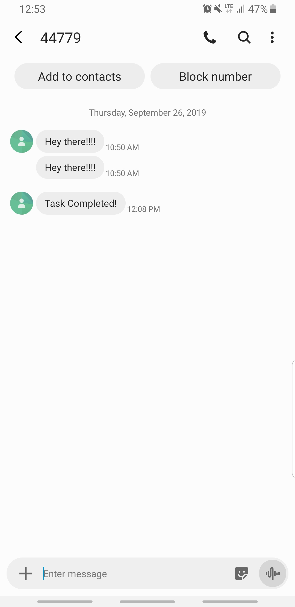

## Lab 32: Lambda Warmers and Triggers
#### Challenge 
* Create a lambda function in Java that can add record to Taskmaster table
* Run this in test mode
* Complete the PUT/UPDATE functionality 
* Keep the function warm
* Configure your DynamoDB Table to invoke your lambda function on database change operations.
#### Approach 
Run the application using ```./gradlew build```
#### Documentation
* a link 
http://taskmaster1-dev1.us-west-2.elasticbeanstalk.com/api1/v2/tasks

## Lab 33 Lambda API Gateway
* link to API Gateway:
https://lvf7rxafk8.execute-api.us-west-2.amazonaws.com/dev/tasks

#### Routes
```
GET /tasks
GET /tasks/{user}
POST /tasks
PUT /tasks/{id}/state
PUT /tasks/{id}/assign/{assignee}
```
#### Route for getting task for single user
add dependencies in build.gradle 
```
GET /tasks/{user}
```
implementation 'com.google.code.gson:gson:2.8.2'

#### Frontend Reactapp link
http://chautthe.s3-website-us-west-2.amazonaws.com/

#### Resources
Classmate: Manish

Source: https://docs.aws.amazon.com/amazondynamodb/latest/developerguide/DynamoDBMapper.QueryScanExample.html

https://gist.github.com/akhilvijayan05/e24f8a96817180659e4d150c394962d8

#### Lab 39. Event Driven Applications
* Link to API Gateway

https://lvf7rxafk8.execute-api.us-west-2.amazonaws.com/dev
#### Routes for API Gateway endpoint that accepts a POST containing a Phone Number in the JSON sent into it’s body
```
POST /tasks/{phoneNumber}
```
#### Test 



